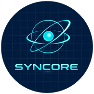
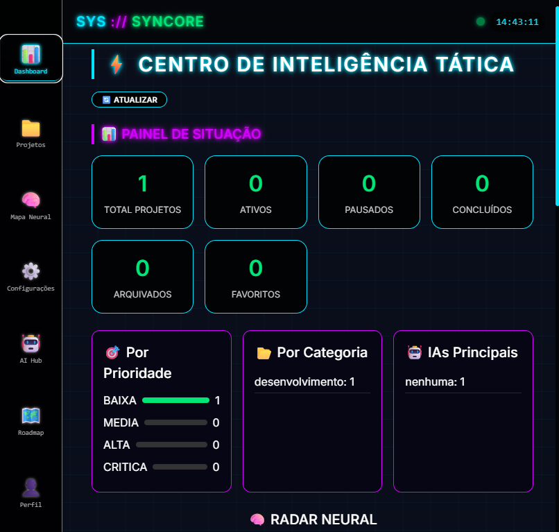
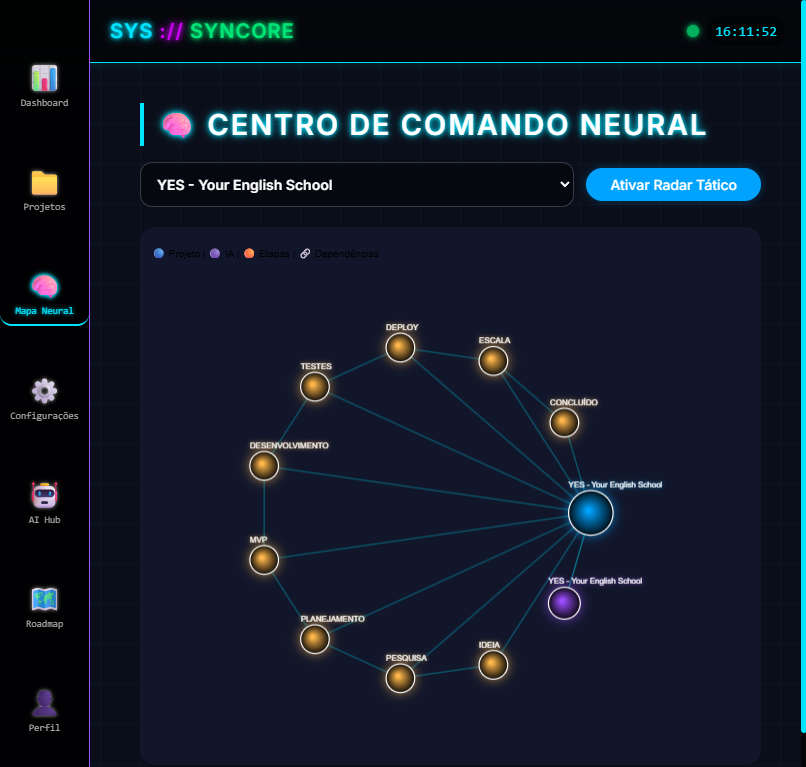
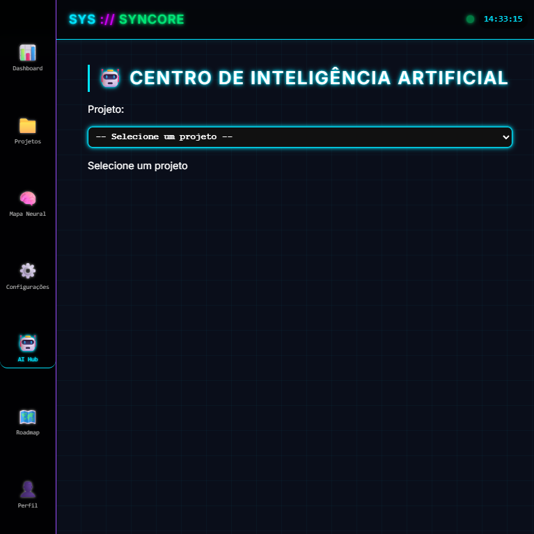
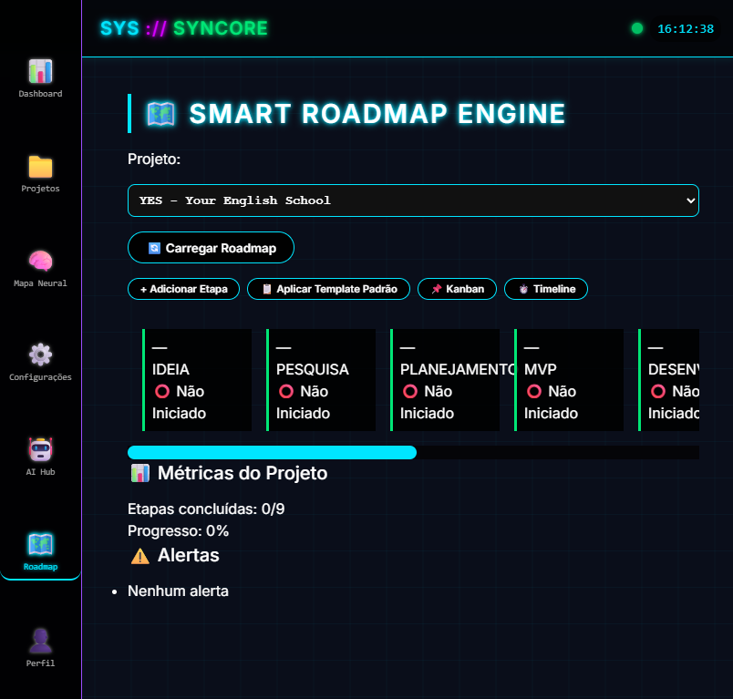
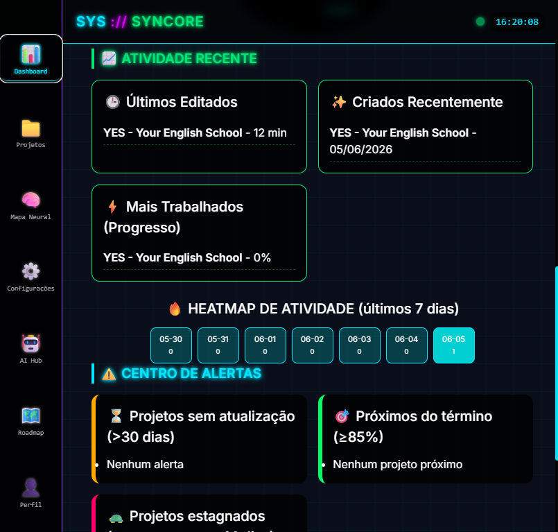
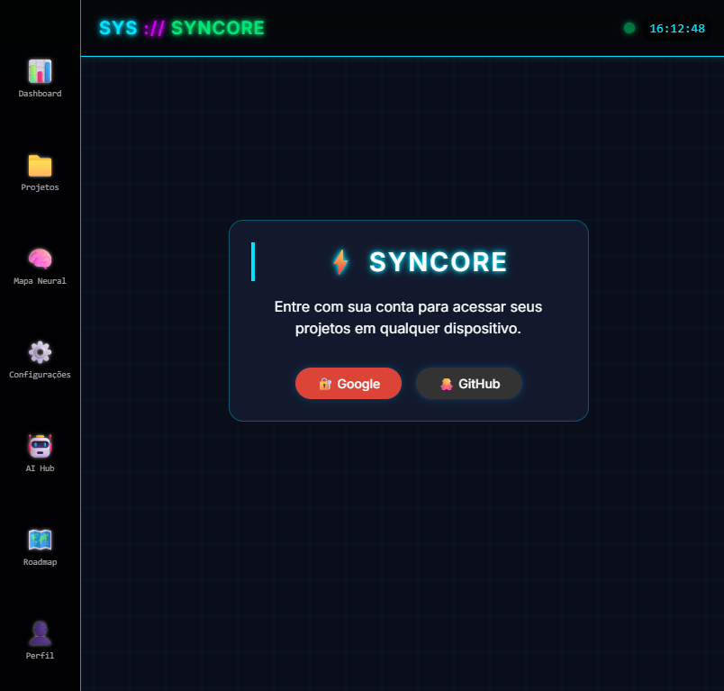

# 🔷 SYNCORE  
### *O Núcleo Sincronizado dos Seus Projetos*

<p align="center">
  
</p>

[](https://web.dev/progressive-web-apps/)
[](https://web.dev/offline-fallback-page/)
[](https://supabase.com)
[](LICENSE)
[](CONTRIBUTING.md)

> **Um espaço de trabalho neural onde projetos, conhecimento e IA se conectam – offline first, cloud ready.**

---

## 📌 Visão Geral

**SYNCORE** é um Progressive Web App (PWA) projetado como um **sistema operacional pessoal para desenvolvimento de software, gestão de projetos e inteligência de equipe**. Ele combina CRUD de projetos, insights com IA, grafos de conhecimento, roadmaps inteligentes e sincronização na nuvem entre dispositivos em uma única interface futurista.

**Para quem?**  
- Desenvolvedores e líderes técnicos  
- Gerentes de produto e times ágeis  
- Freelancers e empreendedores solo  
- Entusiastas de IA e pesquisadores  

**Problema que resolve**  
Ferramentas tradicionais de projeto são isoladas (tarefas, documentos, IA, roadmap). SYNCORE unifica tudo em um **único ambiente offline‑first** que funciona sem internet e sincroniza quando você reconecta.

---

## ✨ Principais Funcionalidades

| Módulo | Descrição |
|--------|-----------|
| 🧠 **Mapa Neural** | Gráfico interativo que visualiza dependências do projeto, colaboradores IA e estágios do roadmap. Zoom, pan, arraste de nós – como um radar tático. |
| 🤖 **AI Hub** | Registre modelos de IA (ChatGPT, Claude, Gemini…), armazene prompts, guarde resultados e analise métricas de uso. |
| 📚 **Centro de Conhecimento** | Central única para notas, links de pesquisa, decisões e histórico de prompts. Busca global em todos os itens. |
| 🗺️ **Roadmaps Inteligentes** | Visualização Kanban + linha do tempo para etapas customizáveis. Cálculo automático de progresso e alertas de prazo. |
| ☁️ **Sincronização Cloud** | Motor de sincronização offline‑first alimentado por **Supabase** (PostgreSQL + RLS). Sincronização em tempo real entre dispositivos. |
| 📊 **Dashboard Inteligente** | KPIs ao vivo, gráficos radar, heatmaps de atividade e alertas proativos (projetos parados, prazos próximos). |

---

## 🖼️ Capturas de Tela

| Dashboard | Neural Map | AI Hub |
|-----------|------------|--------|
|  |  |  |

| Roadmap Kanban | Knowledge Center | Cloud Status |
|----------------|------------------|---------------|
|  |  |  |

---

## 🏗️ Arquitetura

```mermaid
graph LR
    A[PWA / Service Worker] --> B[IndexedDB Cache Local]
    B --> C[Sync Engine]
    C --> D[Supabase Auth & PostgreSQL]
    D --> E[(Dados do Usuário)]
    C -->|Resolução de conflitos| B
    A -->|Offline First| B
